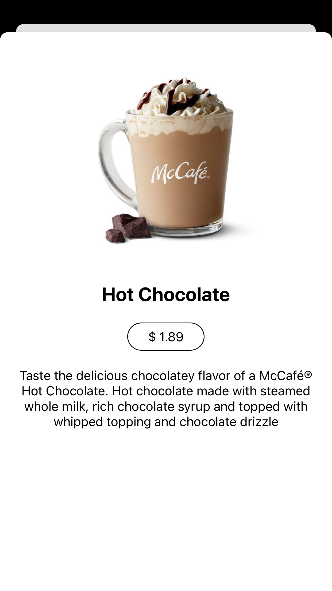

# Menu App

This is a demo app just to show my skills, Enjoy.

## Stack

- React Native = 0.69.6
- Expo = 46.0.0
- Node = 16.15.0

## Screenshots




## Video demo

https://www.loom.com/share/98ad8cb2f01143cbbb52a5a0a6dad5ac

# Link to app public demo

https://expo.dev/@joelcho/menu-app

## Setup
```bash
cd menu-app
npm install
npm start
```

Once server start yo need Expo Go app and scan the qr code on the bash.

## Technical design

https://docs.google.com/document/d/1D-MVwm31D3QKfPMxz57Tz97-6A1mNVZKiusnnhCFa5k/edit?usp=sharing


